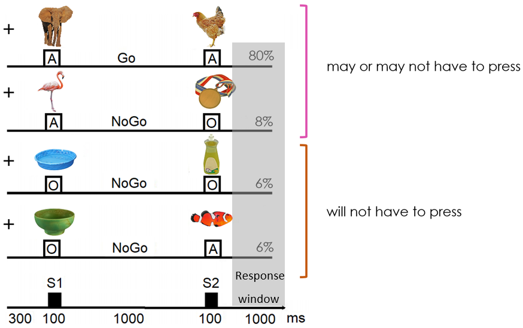

[![Contributors][contributors-shield]][contributors-url]
[![Forks][forks-shield]][forks-url]
[![Stargazers][stars-shield]][stars-url]
[![Issues][issues-shield]][issues-url]
[![MIT License][license-shield]][license-url]
[![LinkedIn][linkedin-shield]][linkedin-url]


<br />
<p align="center">
  <a href="https://github.com/DouweHorsthuis/Active-and-passive-inhibition-experiment-Cued-BOSS/">
    
  </a> 

<h3 align="center">Active and passive inhibition experiment (Cued BOSS) </h3>

<h4 align="center">This project is an active and passive go-no-go inhibition experiment for Presentation® (NeuroBehavioral Systems). For most go-no-go task the participant would be asked to click for a reocorring stimulus and not click for a different type of stimulus that occurs significantly less frequent (inhibition). In this case the participant has a Cue that gives them info if they have to potentially inhibit (active inhibition) or if they need to inhibit for sure (passive inhibition) for the following stimulus. </h4>

<p align="center">
<a href="https://github.com/DouweHorsthuis/Active-and-passive-inhibition-experiment-Cued-BOSS/">
    


**Table of Contents**
  
1. [About the project](#about-the-project)
    - [Built With](#built-with)
2. [Getting started](#getting-started)
    - [Prerequisites](#prerequisites)  
    - [Installation](#installation)
3. [Info about the experiment](#info-about-the-experiment)
    - [Stimuli](#stimuli)
    - [Logfiles](#logfiles)
    - [Sequences](#sequences)
    - [Instructions](#instructions)
    - [Type of responses](#type-of-responses)
    - [Trigger codes](#trigger-codes)
    - [Timing](#timing)
    - [Data collection](#data-collection)
3. [License](#license)
3. [Contact](#contact)
3. [Acknowledgements](#acknowledgements)


<!-- ABOUT THE PROJECT -->
## About The Project

This experiment looks at the the passive and active inhibition during a go-no-go task. This experiment was developed as a follow up study after 
[Ana A. Francisco, Douwe J. Horsthuis, Maryann Popiel, John J. Foxe and Sophie Molholm (2020) Atypical response inhibition and error processing in 22q11.2 Deletion Syndrome and schizophrenia: Towards neuromarkers of disease progression and risk](https://pubmed.ncbi.nlm.nih.gov/32731196/)

Instead of a more traditional go-no-go experiment, this experiment has both active and passive inhibition. Normally the participant would be asked to click for a reocorring stimulus and not click for a different type of stimulus that occurs significantly less frequent. In this case the participant has a Cue that gives them info if they have to potentially inhibit (active inhibition) or if they need to inhibit for sure (passive inhibition). During the experiment participants will see stimulus pairs. If the pair is a animal, followed by an animal, they click (go trial, happens most of the time), for a small amount of the time there might be one of the no-go trials, that never follow each other, so there is always a go-trial before them. The no-go trials are passive (object - animal or object - object) or active (animal- object). 


### Built With

* [Presentation® (NeuroBehavioral Systems)](https://www.neurobs.com/)


<!-- GETTING STARTED -->
## Getting Started

To get a local copy up and running follow these simple steps.

### Prerequisites

You need to have any version of the Presentation software. 

To achieve the same stable time resolution this experiment should be presented on a 60Hz screen.

Please contact douwehorsthuis@gmail.com for access to the stimuli

### Installation

[Download this Repo](https://github.com/DouweHorsthuis/Active-and-passive-inhibition-experiment-Cued-BOSS)

Create 3 folders

Folder 1 - "Presentation Files"  - this folder should contain all the presentation files and Sequences found in the "src" folder

Folder 2 - "Stimuli"            - this folder should contain all the images need for the experiment

Folder 3 - "Logfiles"           - this folder will be filled with all the presentation Logfiles containing the behavioral data


## Info about the experiment

### Stimuli

The stimuli are all the individual animal and object pictures that are taken from the [Bank of Standardized stimuli (BOSS)](https://sites.google.com/site/bosstimuli/).

### Logfiles

Logfiles with experiment reaction times and other information automatically should be placed in the logfile folder. In these logfiles you will find the behavioral information of each time the experiment is ran. 

### Sequences 

In the Presentation Files folder you'll find the experiment and the sequences that are semi-randomized, so we are sure that there are no 2 no-go trials in a row and how many no-go trials there are. These sequences are made so that there are always go trials before a no-go trial

### Instructions

These are the instructions people see 1-by-1 before they start: 

<a href="https://github.com/DouweHorsthuis/Active-and-passive-inhibition-experiment-Cued-BOSS/">
    
    
<a href="https://github.com/DouweHorsthuis/Active-and-passive-inhibition-experiment-Cued-BOSS/">
    
    
<a href="https://github.com/DouweHorsthuis/Active-and-passive-inhibition-experiment-Cued-BOSS/">
    
    
<a href="https://github.com/DouweHorsthuis/Active-and-passive-inhibition-experiment-Cued-BOSS/">
    
 </a> 
 
### Type of responses

This leads to 3 types of response:

1- hits - animal-animal (this is what happens 80 percent of the time)
2- active inhibition - animal-object (since the first one doesn't inform you it will be a inhibition trial)
3- passive inhibition - object-object or object-animal (since the first one already tells that you won't have to care about the second)

### Trigger codes

The presentation software sends codes to the EEG system so that the responses and the stimuli can be time locked in the EEG data. The following is an explanation of each trigger code: 
```
port code 101 = S1 go (animal)
port code 102 = S2 go (animal)
port code 111 = S1 no-go (animal)
port code 112 = S2 no-go (object)
port code 121 = S1 passive(object)
port code 122 = S2 passive (object)
port code 131 = S1 Passive (object)
port code 132 = S2 Passive (animal)
port code 2   = fixation cross
port code 201 = start recording
port code 200 = pause recording 
```

### Timing
The reason this experiment is coded in presentation, is because of the timing resolution of this software/language. When setup correctly this experiment has potentially 1ms of jitter. This is measured here at our lab, using an oscilloscope. It is critical that this is re-tested before EEG data is collected. 

### Data collection
This experiment is used to collected EEG data. To have enough trials one should run all the scenarios in a row. This should lead to enough inhibition errors to look at the data.

<!-- LICENSE -->
## License

Distributed under the MIT License. See [LICENSE](https://github.com/DouweHorsthuis/Active-and-passive-inhibition-experiment-Cued-BOSS/blob/master/LICENSE.txt) for more information.


<!-- CONTACT -->
## Contact

Douwe Horsthuis - [@douwejhorsthuis](https://twitter.com/douwejhorsthuis) - douwehorsthuis@gmail.com - [CNL Albert Einstein College of Medicine](https://www.cognitiveneurolab.com/)

Project Link: [https://github.com/DouweHorsthuis/Active-and-passive-inhibition-experiment-Cued-BOSS/](https://github.com/DouweHorsthuis/Active-and-passive-inhibition-experiment-Cued-BOSS/)


<!-- ACKNOWLEDGEMENTS -->
## Acknowledgements

* [Ana Francisco](https://github.com/anafrancisco) - The post doctoral fellow that had the ideas for the experiment

[contributors-shield]: https://img.shields.io/github/contributors/DouweHorsthuis/Active-and-passive-inhibition-experiment-Cued-BOSS.svg?style=for-the-badge
[contributors-url]: https://github.com/DouweHorsthuis/Active-and-passive-inhibition-experiment-Cued-BOSS/graphs/contributors
[forks-shield]: https://img.shields.io/github/forks/DouweHorsthuis/Active-and-passive-inhibition-experiment-Cued-BOSS.svg?style=for-the-badge
[forks-url]: https://github.com/DouweHorsthuis/Active-and-passive-inhibition-experiment-Cued-BOSS/network/members
[stars-shield]: https://img.shields.io/github/stars/DouweHorsthuis/Active-and-passive-inhibition-experiment-Cued-BOSS.svg?style=for-the-badge
[stars-url]: https://github.com/DouweHorsthuis/Active-and-passive-inhibition-experiment-Cued-BOSS/stargazers
[issues-shield]: https://img.shields.io/github/issues/DouweHorsthuis/Active-and-passive-inhibition-experiment-Cued-BOSS.svg?style=for-the-badge
[issues-url]: https://github.com/DouweHorsthuis/Active-and-passive-inhibition-experiment-Cued-BOSS/issues
[license-shield]: https://img.shields.io/github/license/DouweHorsthuis/Active-and-passive-inhibition-experiment-Cued-BOSS.svg?style=for-the-badge
[license-url]: https://github.com/DouweHorsthuis/Active-and-passive-inhibition-experiment-Cued-BOSS/blob/master/LICENSE.txt
[linkedin-shield]: https://img.shields.io/badge/-LinkedIn-black.svg?style=for-the-badge&logo=linkedin&colorB=555
[linkedin-url]: https://linkedin.com/in/douwe-horsthuis-725bb9188